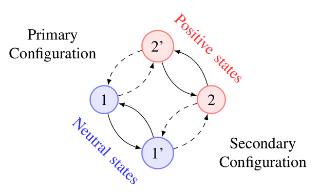

Theory of RASI
==============

The models implemented in RASI are used to described interactions between the
carrier gas in semiconductor devices and point defects. The intended field of
application for the package is the research of reliability topics such as the
Bias-Temperature Instability and related degradation phenomena.  The defect
models implemented in RASI describe multi-state defects which exchange carriers
with the semiconductor device through multi-phonon transitions [MREL2012]_.

Multi-State Defects
-------------------

Defects in the multi-state multi-phonon model can exist in two different charge states and
two different configurations (internal states). The degradation and recovery transients
observed in BTS-experiments are understood as an ensemble response of these multi-state
defects [SISPAD2013]_.

Transitions between the internal states are understood as barrier hopping transitions
and modeled using a simple Arrhenius law

.. math:: k_{ij} = \nu \exp\big ( \frac{E_{ij}}{k_B T} \big )

where :math:`k_{ij}` is the hopping rate from state i to j, :math:`\nu` is the attempt frequency, 
and :math:`E_{ij}` is the barrier for going from state i to j. Transitions involving a change
of the charge state are understood as thermally activated carrier trapping events and described
in the framework of non-radiative multi-phonon transitions.

Thermally Activated Carrier Trapping
------------------------------------

The exchange of charge between the defect and the rest of the device is modeled in the framework
of the multi-phonon transition theory. Central to this theory is the concept of line shape functions,
which can be understood as a capture cross section that depends on the carrier energy, temperature and
the electric fields in the device [SISPAD2013]_. 

Bibliography
------------
.. [MREL2012] `T. Grasser: "Stochastic Charge Trapping in Oxides: From Random Telegraph Noise to Bias Temperature Instabilities"; Microelectronics Reliability, 52 (invited) (2012), 39 - 70 <http://dx.doi.org/10.1016/j.microrel.2011.09.002>`_
.. [SISPAD2013] `F. Schanovsky, W. Gös, T. Grasser: "Advanced Modeling of Charge Trapping at Oxide Defects"; International Conference on Simulation of Semiconductor Processes and Devices (SISPAD), Glasgow, Scotland, United Kingdom; <http://www.iue.tuwien.ac.at/pdf/ib_2013/CP2013_Schanovsky_2.pdf>`_
